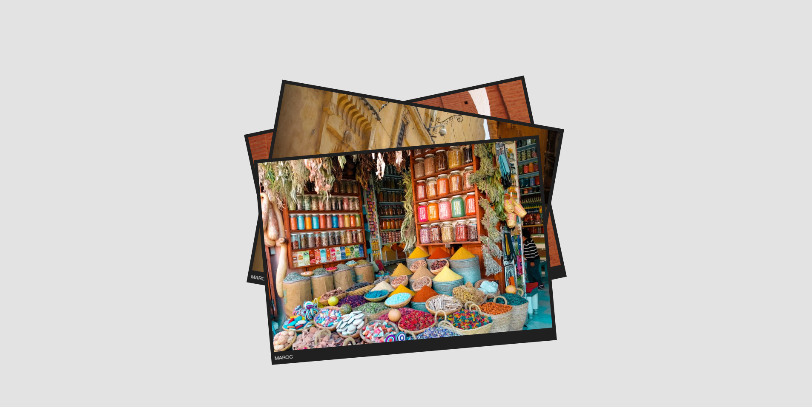

# ScrollMotionCards

Un projet d'animation de cartes avec défilement fluide, utilisant **Lenis** pour le smooth scroll et **GSAP** pour les animations.



## Fonctionnalités
- **Défilement fluide** : Utilisation de Lenis pour un défilement doux.
- **Animation des cartes** : Les cartes apparaissent avec des rotations et des décalages dynamiques.

## Technologies Utilisées
- Lenis : Pour le smooth scroll.
- [GSAP](https://gsap.com) : Pour les animations.
- HTML / CSS / JavaScript : Pour la structure, le style et la logique.

## Installation
1. Clonez ce repository :
   ```bash
   git clone https://github.com/JAOUADERRADI/ScrollMotionCards.git
